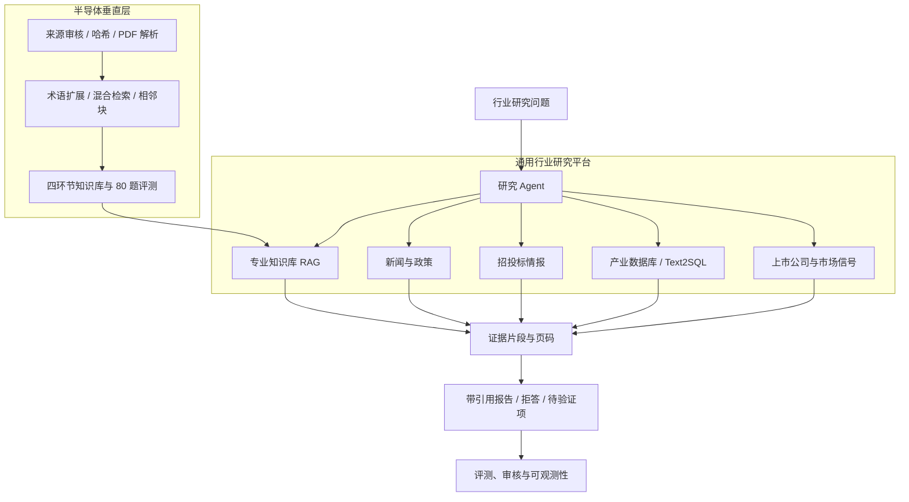

# 证据驱动行业研究平台

一个面向技术、产业与公司研究的多源大模型平台，并以**半导体全产业链**作为深度垂直落地。
平台统一承载专业知识库、新闻政策、招投标、产业数据库、Text2SQL、上市公司行情和研究 Agent；
半导体垂直层则提供从芯片设计与 EDA/IP、材料与设备、晶圆制造到封装测试的来源治理、
检索策略、评测集和可追溯引用。

这个项目重点解决的不是“让模型记住更多知识”，而是让研究结论满足四个条件：

- **有来源**：资料进入知识库前记录发布方、许可、哈希和审核状态；
- **找得准**：稠密检索、词法检索、多查询扩展和相邻块补全共同召回证据；
- **说得清**：回答中的事实结论带文档与页码引用，证据不足时拒答；
- **可验证**：检索、回答质量、并发、上下文边界和故障恢复都有固定数据集与报告。

> 当前定位是“通用研究平台骨架 + 半导体证据链深度验证”的研究型 MVP，不是已上线的生产系统。
> 原始 PDF、公司代码和评测私有答案不随仓库公开；公开前仍需确认代码、数据和报告的授权范围。
> 本仓库不添加开源许可证，按保留全部权利的私有面试展示项目管理；未经明确许可，不授权复制、
> 修改、分发或商用。

## 双层定位与业务闭环



平台目标问题不只包括“某项技术是什么”，还包括“技术路线是否成熟、政策与采购需求是否印证、
哪些公司可能受益、结构化数据是否支持该判断”。系统区分文档事实、时效性情报、结构化数据、
模型推断和待验证项，让研究员回到原始来源复核，而不是把模型回答当作事实终点。

半导体是当前唯一完成专用语料、检索消融、回答质量、拒答、并发和 Agent 可靠性验收的垂直领域。
新闻、招投标、Text2SQL 和股票能力已有前后端入口或 Agent 接线；冻结脱敏 fixture 上的多源
Runner 已完成 12/12 确定性端到端门禁，但真实在线数据源仍未达到文档 RAG 的评测深度。

## 平台能力成熟度

| 能力 | 当前状态 | 可以证明什么 | 下一项验收 |
| --- | --- | --- | --- |
| 文档 RAG 与引用 | 已深度验证 | 真实 PDF、混合检索、逐主张引用、拒答与固定评测 | 独立 blind-v2 |
| Research Agent | 已验证控制面 | 规划、取消、超时、检查点、精确恢复和审核否决 | 多源成功终态与幂等性 |
| 新闻与政策 | 已接入 | API、数据库模型、采集服务和前端列表存在 | 半导体时效性题集、去重和来源质量 |
| 招投标 | 已接入 | 行业关键词、采集接口和独立页面存在 | 供应商归一、公告去重和需求信号评测 |
| 产业数据 / Text2SQL | 已接入 | 表浏览、白名单表与自然语言查询接口存在 | SQL 安全、执行正确率和结构化引用 |
| 股票与公司信号 | 条件接入 | Agent 可识别公司并返回行情卡片 | 数据时效、公司映射和失败降级 |
| 多源联合报告 | fixture 闭环 | 先进封装 12/12：工具规划、检索、引用、推断/冲突标注与拒答 | 真实在线多源盲测 |

## 已验证基线

以下数字均来自仓库中的固定脚本和 JSON 报告，不外推为真实业务准确率：

| 环节 | 当前结果 | 解释 |
| --- | ---: | --- |
| 来源治理 | 17 个候选，15 个批准，2 个仅元数据 | 批准项具备来源、许可判断和内容哈希 |
| 真实语料 | 12 份 PDF、1,327 页、5,256 个块 | 覆盖四个产业链集合 |
| development 检索 | 混合多查询 20/20 | 单查询 dense 仅 3/20，体现消融价值 |
| regression 检索 | 混合检索 + 相邻块 20/20 | 是固定回归集结果，不代表开放域 100% |
| regression 端到端回答 | 16/20 严格质量通过，拒答 4/4 | P95 12.477 秒，本地 4B 模型 |
| 并发压力 | 并发 4 时 8/8，P95 10.217 秒 | 并发 8 时 P95 19.919 秒，已接近饱和 |
| 上下文压力 | 600,400 输入 token 中选取 3,002/6,000 | 证据预算生效；尚非统一总上下文预算 |
| 多源联合研究 | 冻结脱敏 fixture 12/12 | 确定性 Runner 逐题执行，不代表线上数据质量 |
| 自动化验证 | 后端 162/162，前端 lint/build 通过 | 161 个 unit + 1 个 Milvus Lite integration |

对应报告见 [`reports/`](reports/)，评测口径见
[`docs/RAG_EVALUATION_PROTOCOL.md`](docs/RAG_EVALUATION_PROTOCOL.md)。简历与项目介绍中的
基线数字只以 [`reports/baseline-manifest.json`](reports/baseline-manifest.json) 指向的冻结报告为准；
`latest` 或 `working` 报告仅用于实验，不作为对外声明依据。

## 核心设计

### 1. 通用平台与垂直领域解耦

通用层提供工具协议、会话、记忆、结构化数据、外部信息和研究状态机；领域层提供知识库名称、
搜索关键词、招投标关键词、研究问题、来源政策与评测数据。新增行业不应复制 Agent，而应新增
领域配置、经审核的语料和独立评测集。

### 2. 资料治理与可复现入库

来源注册表将 `candidate → approved / metadata-only` 审核与 PDF 下载解耦；内容以 SHA-256 校验，
解析结果保留 `source_id`、文档名、页码和许可元数据。入库审计会同时核对 PostgreSQL 文档记录、
Milvus 实体数和重复 `(doc_id, chunk_index)`，避免“接口显示成功但索引不完整”。

### 3. 混合检索与引用

系统用多查询扩展提高表达覆盖，以向量相似度和词法命中共同打分，再补回相邻块恢复跨页语境。
生成阶段只使用预算内证据，并要求回答引用检索结果。`rrf_score` 目前用于诊断，最终排序并非
RRF 融合；这一点不会在项目介绍中夸大。

### 4. 研究 Agent 与可靠性

深度研究流程包含计划、检索、分析、生成、审核和结束状态；支持超时、取消、检查点和从
`last_completed_phase` 精确恢复。审核发现 critical/major 问题时不能被迭代上限误判为完成。
当前在线聊天走显式编排逻辑，不能表述成“线上由 LangGraph 执行”。

### 5. 性能与可观测性

同步检索和模型调用由线程池迭代，避免流式响应阻塞 Uvicorn 事件循环。服务暴露 liveness、
readiness 和 Prometheus 指标；readiness 可选择校验生成模型与 embedding 模型是否真实可用。

## 快速复现

### 前置条件

- Docker Engine / Docker Desktop 与 Compose；
- 宿主机 Ollama 已提供 `industry-qwen3:4b` 和 `bge-m3`；
- 端口 `5173`、`8000`、`5432`、`6379`、`9000`、`9001`、`19530` 可用。

完整容器化启动：

```bash
./start-services.sh app
```

启动脚本会读取 Git 忽略的 `backend/.env`。`MODEL_ROUTING_MODE` 支持：

- `local`：生成与 Agent 固定使用宿主机 Ollama 的 `industry-qwen3:4b`；
- `cloud`：固定使用 `CLOUD_LLM_*` 指定的云端模型；
- `auto`：云端 API Key、Base URL 和模型名完整时使用云端，否则回退本地模型。

云端模型统一通过百炼 OpenAI 兼容接口调用，并只使用一个 `DASHSCOPE_API_KEY`。
默认分层为：普通问答、检索和代码节点使用 `deepseek-v4-flash`，研究规划、
数据分析、质量审核和最终写作使用 `deepseek-v4-pro`。向量召回后使用百炼
`qwen3-rerank` 对候选片段做一次批量重排，失败时保留原检索分数降级。

Embedding 支持 `cloud` / `local` / `hybrid` 三种路由。云端使用百炼
`text-embedding-v4`，本地使用 Ollama `bge-m3`，均为 1024 维但写入独立
Collection。`hybrid` 模式双路召回后使用 RRF 融合，再交给 `qwen3-rerank`
精排；任一路失败时会在结果中显示 `degraded_route`。默认查询路由为
`cloud`，入库同时构建两套索引。详细契约见
[`docs/EMBEDDING_ROUTING_DESIGN.md`](docs/EMBEDDING_ROUTING_DESIGN.md)。

云端密钥只放在 `backend/.env` 的 `DASHSCOPE_API_KEY`，不要写入 Compose
或提交到 Git。

启动脚本会构建前后端并等待 PostgreSQL、Redis、Milvus、模型和应用 readiness。入口：

- Web：<http://localhost:5173>
- OpenAPI：<http://localhost:8000/docs>
- Liveness：<http://localhost:8000/health/live>
- Readiness：<http://localhost:8000/health/ready>

创建演示用户：

```bash
curl -X POST http://localhost:8000/auth/register \
  -H 'Content-Type: application/json' \
  -d '{"username":"research_demo","email":"research_demo@example.com","password":"ResearchDemo123!"}'
```

创建四个产业链知识库：

```bash
docker compose --profile app exec backend \
  python scripts/seed_semiconductor_knowledge_bases.py --username research_demo
```

仓库不分发原始 PDF。按
[`docs/PUBLIC_SEMICONDUCTOR_SOURCES.md`](docs/PUBLIC_SEMICONDUCTOR_SOURCES.md)
下载并完成哈希审核后，执行：

```bash
docker compose --profile app exec backend \
  python scripts/ingest_approved_sources.py \
  --username research_demo \
  --queue /data/semiconductor_sources/review/candidates-v2.jsonl \
  --chunk-size 1200 \
  --report /tmp/ingestion-report.json
```

宿主机开发模式、故障演示和完整验收步骤见
[`docs/DEPLOYMENT_AND_DEMO.md`](docs/DEPLOYMENT_AND_DEMO.md)。

## 验证命令

```bash
make check                       # 依赖、162 个后端测试、前端、Compose、数据与评测隔离
make validate-observability      # Prometheus 配置与 4 条告警规则
make build-images                # 构建非 root 后端镜像与 Nginx 前端镜像
make demo-rag                    # 正例、跨环节问题与无证据拒答
make load-test-chat              # 带质量门槛的并发测试
make stress-context-budget       # 长证据输入预算压力测试
```

公开评测分为 40 题有标签 development/regression 和 40 题无答案 test/hidden；CI 会拒绝在
test/hidden 文件中出现答案字段，降低评测泄漏风险。完整 80 题键只存放在 Git 忽略目录。

## 目录结构

```text
backend/                 FastAPI、RAG、研究 Agent、评测与入库脚本
frontend/                React 前端与 Nginx 运行镜像
data/                    来源注册表、规范化文本；原始 PDF 不提交
sample-data/             可公开的开发/回归题和 questions-only 题集
reports/                 消融、回答、并发、上下文和审计报告
docker/                  Prometheus 配置和告警规则
docs/                    设计、运行手册、学习与面试材料
docker-compose.yml       core / app / search / observability profiles
```

## 深入学习与面试

- [`docs/LEARNING_AND_INTERVIEW_GUIDE.md`](docs/LEARNING_AND_INTERVIEW_GUIDE.md)：代码阅读顺序、
  检索公式、11 个真实故障、20 个深挖问题和四周学习计划；
- [`docs/MULTI_SOURCE_RESEARCH_PLATFORM.md`](docs/MULTI_SOURCE_RESEARCH_PLATFORM.md)：平台/垂直分层、
  多源联合研究目标链路和各模块验收口径；
- [`docs/PORTFOLIO_AND_RESUME.md`](docs/PORTFOLIO_AND_RESUME.md)：30 秒/2 分钟介绍、STAR 案例、
  简历 bullet 和 15 分钟演示脚本；
- [`docs/NEXT_MODEL_HANDOFF.md`](docs/NEXT_MODEL_HANDOFF.md)：交给其他模型继续开发时的事实、约束、
  优先级和可直接复制的提示词；
- [`docs/CLAIM_CITATION_EVALUATION.md`](docs/CLAIM_CITATION_EVALUATION.md)：逐主张引用评测；
- [`docs/AGENT_RELIABILITY.md`](docs/AGENT_RELIABILITY.md)：取消、恢复、审核与状态机约束；
- [`docs/PERFORMANCE_AND_LOAD_TESTING.md`](docs/PERFORMANCE_AND_LOAD_TESTING.md)：并发实验与容量边界；
- [`docs/OBSERVABILITY.md`](docs/OBSERVABILITY.md)：指标、告警和排障入口。
- [`docs/SECURITY.md`](docs/SECURITY.md)：鉴权、限流、上传边界与安全部署要求。

## 已知边界

- 语料规模不足以声称“覆盖全部半导体知识”；词法召回仍是内存扫描，不适合大规模生产索引；
- 6,000-token 仅约束检索证据，尚未统一系统指令、问题、历史、记忆和输出预算；
- 本地 4B 语义裁判效果不稳定，默认关闭；它也不是形式化蕴含证明；
- `/metrics` 是单进程语义，尚无多 worker 聚合与分布式 trace；
- 数据库目前依赖自动建表，尚无 Alembic 迁移链；部署不包含 TLS、HA、备份和生产级密钥托管；
- 旧评测曾发生标签暴露，因此当前分数只作阶段验收；下一轮可信泛化结论需要独立 blind-v2；
- 新闻、招投标、Text2SQL 和股票已通过冻结 fixture 的 12 题联合门禁，但缺少真实在线数据盲测；
- 多源事实尚未统一 provenance 契约，新闻、SQL 行和行情数据不能复用 PDF 页码式引用；
- 前端主 bundle 约 2.56 MB，仍需路由级代码分割；
- 项目尚未获得公开发布确认；GitHub 仓库保持私有。

完整闭环状态与后续优先级见
[`docs/PROJECT_CLOSURE_ROADMAP.md`](docs/PROJECT_CLOSURE_ROADMAP.md)。
