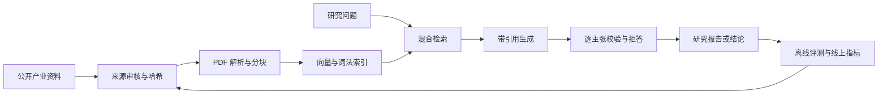

# 半导体全产业链研究助手

一个面向产业研究场景的证据驱动大模型应用：从芯片设计与 EDA/IP、材料与设备、
晶圆制造到封装测试，对公开资料进行治理、解析、检索和引用，生成可回溯到原始文档的研究回答。

这个项目重点解决的不是“让模型记住更多半导体知识”，而是让研究结论满足四个条件：

- **有来源**：资料进入知识库前记录发布方、许可、哈希和审核状态；
- **找得准**：稠密检索、词法检索、多查询扩展和相邻块补全共同召回证据；
- **说得清**：回答中的事实结论带文档与页码引用，证据不足时拒答；
- **可验证**：检索、回答质量、并发、上下文边界和故障恢复都有固定数据集与报告。

> 当前定位是可在本地复现的研究型 MVP，不是已上线的生产系统。原始 PDF、公司代码和
> 评测私有答案不随仓库公开；公开前仍需确认代码、数据和报告的授权范围。

## 业务闭环



典型问题包括：某类设备位于哪一道工艺、某项先进封装标准解决什么互连问题、某份产业报告
如何定义市场环节，以及多个来源对同一技术判断是否一致。系统保留证据片段和页码，研究员可
回到原文复核，而不是把模型回答当作事实终点。

## 已验证基线

以下数字均来自仓库中的固定脚本和 JSON 报告，不外推为真实业务准确率：

| 环节 | 当前结果 | 解释 |
| --- | ---: | --- |
| 来源治理 | 17 个候选，15 个批准，2 个仅元数据 | 批准项具备来源、许可判断和内容哈希 |
| 真实语料 | 12 份 PDF、1,327 页、5,256 个块 | 覆盖四个产业链集合 |
| development 检索 | 混合多查询 20/20 | 单查询 dense 仅 3/20，体现消融价值 |
| regression 检索 | 混合检索 + 相邻块 20/20 | 是固定回归集结果，不代表开放域 100% |
| regression 端到端回答 | 16/20 严格质量通过，拒答 4/4 | P95 12.477 秒，本地 4B 模型 |
| 并发压力 | 并发 4 时 8/8，P95 10.217 秒 | 并发 8 时 P95 19.919 秒，已接近饱和 |
| 上下文压力 | 600,400 输入 token 中选取 3,002/6,000 | 证据预算生效；尚非统一总上下文预算 |
| 自动化验证 | 后端 100/100，前端 lint/build 通过 | 同时验证依赖、Compose、来源和评测隔离 |

对应报告见 [`reports/`](reports/)，评测口径见
[`docs/RAG_EVALUATION_PROTOCOL.md`](docs/RAG_EVALUATION_PROTOCOL.md)。

## 核心设计

### 1. 资料治理与可复现入库

来源注册表将 `candidate → approved / metadata-only` 审核与 PDF 下载解耦；内容以 SHA-256 校验，
解析结果保留 `source_id`、文档名、页码和许可元数据。入库审计会同时核对 PostgreSQL 文档记录、
Milvus 实体数和重复 `(doc_id, chunk_index)`，避免“接口显示成功但索引不完整”。

### 2. 混合检索与引用

系统用多查询扩展提高表达覆盖，以向量相似度和词法命中共同打分，再补回相邻块恢复跨页语境。
生成阶段只使用预算内证据，并要求回答引用检索结果。`rrf_score` 目前用于诊断，最终排序并非
RRF 融合；这一点不会在项目介绍中夸大。

### 3. 研究 Agent 与可靠性

深度研究流程包含计划、检索、分析、生成、审核和结束状态；支持超时、取消、检查点和从
`last_completed_phase` 精确恢复。审核发现 critical/major 问题时不能被迭代上限误判为完成。
当前在线聊天走显式编排逻辑，不能表述成“线上由 LangGraph 执行”。

### 4. 性能与可观测性

同步检索和模型调用由线程池迭代，避免流式响应阻塞 Uvicorn 事件循环。服务暴露 liveness、
readiness 和 Prometheus 指标；readiness 可选择校验生成模型与 embedding 模型是否真实可用。

## 快速复现

### 前置条件

- Docker Engine / Docker Desktop 与 Compose；
- 宿主机 Ollama 已提供 `industry-qwen3:4b` 和 `bge-m3`；
- 端口 `5173`、`8000`、`5432`、`6379`、`9000`、`9001`、`19530` 可用。

完整容器化启动：

```bash
./start-services.sh app
```

启动脚本会构建前后端并等待 PostgreSQL、Redis、Milvus、模型和应用 readiness。入口：

- Web：<http://localhost:5173>
- OpenAPI：<http://localhost:8000/docs>
- Liveness：<http://localhost:8000/health/live>
- Readiness：<http://localhost:8000/health/ready>

创建演示用户：

```bash
curl -X POST http://localhost:8000/auth/register \
  -H 'Content-Type: application/json' \
  -d '{"username":"research_demo","email":"research_demo@example.com","password":"ResearchDemo123!"}'
```

创建四个产业链知识库：

```bash
docker compose --profile app exec backend \
  python scripts/seed_semiconductor_knowledge_bases.py --username research_demo
```

仓库不分发原始 PDF。按
[`docs/PUBLIC_SEMICONDUCTOR_SOURCES.md`](docs/PUBLIC_SEMICONDUCTOR_SOURCES.md)
下载并完成哈希审核后，执行：

```bash
docker compose --profile app exec backend \
  python scripts/ingest_approved_sources.py \
  --username research_demo \
  --queue /data/semiconductor_sources/review/candidates-v2.jsonl \
  --chunk-size 1200 \
  --report /tmp/ingestion-report.json
```

宿主机开发模式、故障演示和完整验收步骤见
[`docs/DEPLOYMENT_AND_DEMO.md`](docs/DEPLOYMENT_AND_DEMO.md)。

## 验证命令

```bash
make check                       # 依赖、100 个后端测试、前端、Compose、数据与评测隔离
make validate-observability      # Prometheus 配置与 4 条告警规则
make build-images                # 构建非 root 后端镜像与 Nginx 前端镜像
make demo-rag                    # 正例、跨环节问题与无证据拒答
make load-test-chat              # 带质量门槛的并发测试
make stress-context-budget       # 长证据输入预算压力测试
```

公开评测分为 40 题有标签 development/regression 和 40 题无答案 test/hidden；CI 会拒绝在
test/hidden 文件中出现答案字段，降低评测泄漏风险。完整 80 题键只存放在 Git 忽略目录。

## 目录结构

```text
backend/                 FastAPI、RAG、研究 Agent、评测与入库脚本
frontend/                React 前端与 Nginx 运行镜像
data/                    来源注册表、规范化文本；原始 PDF 不提交
sample-data/             可公开的开发/回归题和 questions-only 题集
reports/                 消融、回答、并发、上下文和审计报告
docker/                  Prometheus 配置和告警规则
docs/                    设计、运行手册、学习与面试材料
docker-compose.yml       core / app / search / observability profiles
```

## 深入学习与面试

- [`docs/LEARNING_AND_INTERVIEW_GUIDE.md`](docs/LEARNING_AND_INTERVIEW_GUIDE.md)：代码阅读顺序、
  检索公式、11 个真实故障、20 个深挖问题和四周学习计划；
- [`docs/PORTFOLIO_AND_RESUME.md`](docs/PORTFOLIO_AND_RESUME.md)：30 秒/2 分钟介绍、STAR 案例、
  简历 bullet 和 15 分钟演示脚本；
- [`docs/CLAIM_CITATION_EVALUATION.md`](docs/CLAIM_CITATION_EVALUATION.md)：逐主张引用评测；
- [`docs/AGENT_RELIABILITY.md`](docs/AGENT_RELIABILITY.md)：取消、恢复、审核与状态机约束；
- [`docs/PERFORMANCE_AND_LOAD_TESTING.md`](docs/PERFORMANCE_AND_LOAD_TESTING.md)：并发实验与容量边界；
- [`docs/OBSERVABILITY.md`](docs/OBSERVABILITY.md)：指标、告警和排障入口。

## 已知边界

- 语料规模不足以声称“覆盖全部半导体知识”；词法召回仍是内存扫描，不适合大规模生产索引；
- 6,000-token 仅约束检索证据，尚未统一系统指令、问题、历史、记忆和输出预算；
- 本地 4B 语义裁判效果不稳定，默认关闭；它也不是形式化蕴含证明；
- `/metrics` 是单进程语义，尚无多 worker 聚合与分布式 trace；
- 数据库目前依赖自动建表，尚无 Alembic 迁移链；部署不包含 TLS、HA、备份和生产级密钥托管；
- 旧评测曾发生标签暴露，因此当前分数只作阶段验收；下一轮可信泛化结论需要独立 blind-v2；
- 前端主 bundle 约 2.56 MB，仍需路由级代码分割；
- 项目尚未获得公开发布确认，也没有远端 CI 运行记录。

完整闭环状态与后续优先级见
[`docs/PROJECT_CLOSURE_ROADMAP.md`](docs/PROJECT_CLOSURE_ROADMAP.md)。
