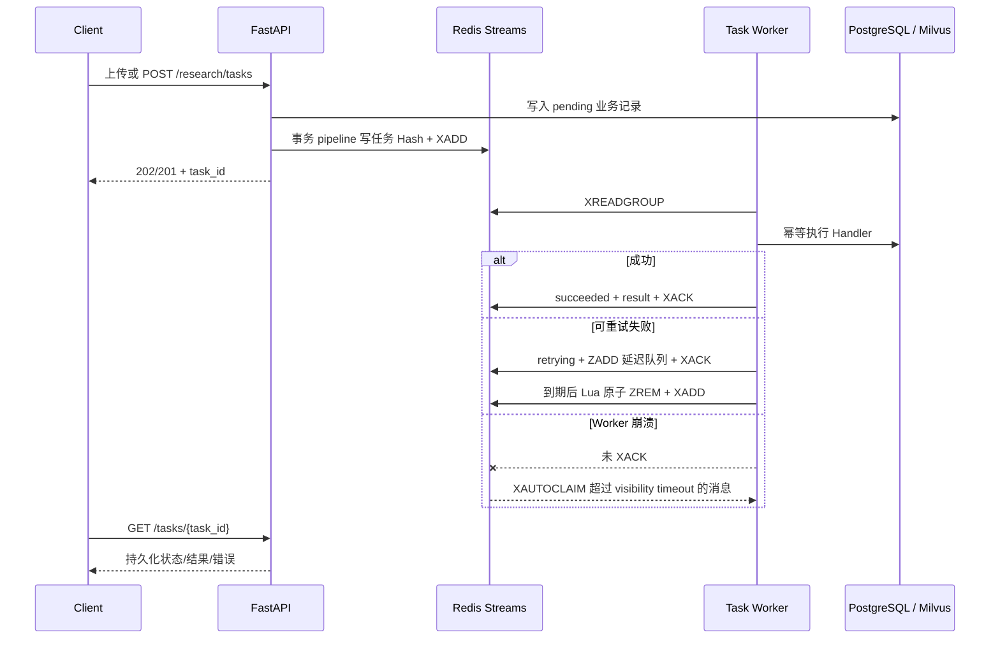

# 持久化异步任务设计

## 目标与边界

文档入库、附件解析和非流式深度研究不再依赖 FastAPI 进程内
`BackgroundTasks` 或内存任务表。API 只负责校验、持久化业务记录和入队，独立
Worker 执行耗时工作。Redis 不可用时接口返回 503，不会降级到不可恢复的
进程内执行。

当前语义是至少一次投递（at-least-once），不声称 exactly-once。业务 Handler
因此必须使用稳定业务 ID，并将数据库状态更新设计为可重入。

## 执行协议



任务状态机：

```text
queued -> running -> succeeded
                  -> retrying -> running
                  -> failed
queued/retrying/running -> cancelled
```

- Hash 保存 payload、owner、尝试次数、超时、结果和终态；
- Stream consumer group 实现多 Worker 争抢与未确认消息恢复；
- Sorted Set 保存指数退避期间的任务；
- 任务 Hash 默认保留 7 天，用户索引在查询时清理过期引用；
- Worker 只裁剪已确认 Stream 条目，不删除 pending 恢复点。

## API

- `POST /research/tasks`：入队 V2 研究，返回 `task_id`、`session_id`和状态 URL；
- `GET /tasks`：按当前登录用户列出最近任务；
- `GET /tasks/{task_id}`：返回状态、尝试次数、错误和结果；
- `POST /tasks/{task_id}/cancel`：持久化取消标记；研究任务同时写入现有
  Research cancellation 控制面；
- 文档和附件上传响应新增 `task_id`，原业务状态字段保持不变。

任务所有权由 `owner_id` 硬性隔离：查询其他用户的 ID 统一返回 404，避免泄露
任务是否存在。
文档和附件 Handler 含不可中断的同步解析/入库步骤，因此开始执行后拒绝取消并返回
409，不会把“副作用已完成”误报为 cancelled。

## 容器与运维

Compose `app` profile 增加 `task-worker`，API 只在 Worker 心跳健康后启动。
API readiness 在 `READINESS_CHECK_TASK_WORKER=true` 时持续检查心跳，因此 Worker
事后崩溃也会使实例退出就绪状态。

API 和 Worker 共享 `task_uploads` 命名卷：

```text
/data/task_uploads/knowledge
/data/task_uploads/attachments
```

成功处理后 Handler 删除原文件；重试期间保留文件，防止下一次尝试失去输入。
Redis 开启 AOF，容器重启后任务 Hash、Stream 和延迟队列仍在。

Prometheus 独立抓取 `task-worker:8001`，核心指标为：

- `industry_background_task_queue_depth`；
- `industry_background_tasks_total{task_type,outcome}`；
- `industry_background_task_duration_seconds{task_type,outcome}`。

Grafana 看板展示积压和尝试结果；Prometheus 对 Worker 掉线、持续积压和执行错误
分别告警。

## 验证

```bash
make test-backend-unit
REDIS_TASK_QUEUE_TEST_URL=redis://127.0.0.1:6379/15 make test-backend-integration
docker compose --profile app up --build -d --wait
docker compose --profile app restart task-worker
docker compose --profile app ps
```

`backend/test/test_persistent_task_queue.py` 覆盖持久化重建、重试、超时、取消、
崩溃认领、用户隔离和 payload 上限。
